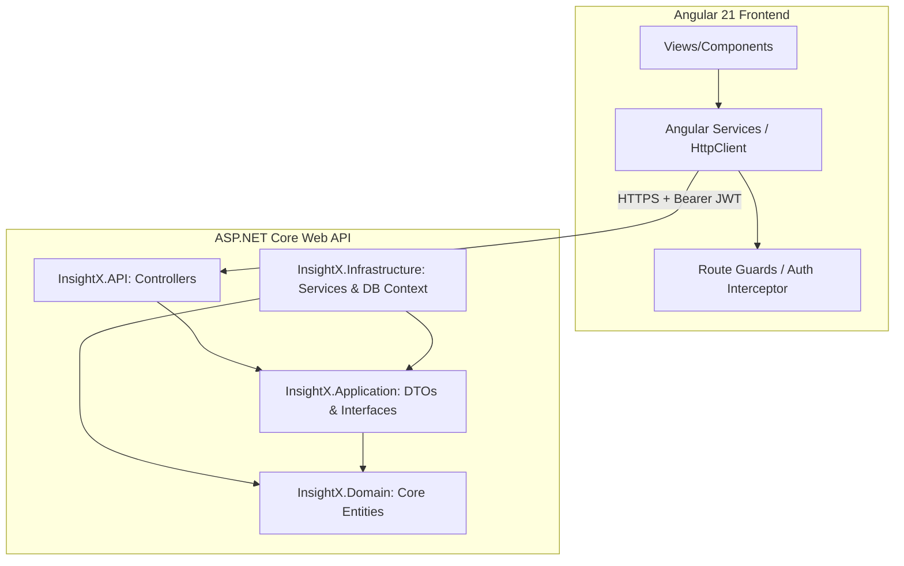

# InsightX Project Architecture

This document describes the design, directory structure, and request lifecycle for the InsightX application.

---

## 🏗️ System Overview

InsightX is built using a decoupled architecture comprising an **Angular 21 Frontend** and an **ASP.NET Core Web API Backend**.

---

## 🗄️ Backend Architecture Details (`/BackEnd`)

The backend is built around **Clean Architecture (Onion Architecture)** principles to maximize testability, separation of concerns, and dependency isolation.

### 1. Presentation Layer (`InsightX.API`)
* **Role:** Exposes RESTful endpoints, parses HTTP request bodies, handles CORS, and returns JSON payloads.
* **Key Components:**
  * **Controllers:** Handlers for route prefixes like `/auth`, `/companies`, `/departments`, `/kpis`, and `/users`.
  * **Dependency Injection Config:** Bootstraps program services, DB context connections, and JWT validation.

### 2. Application Layer (`InsightX.Application`)
* **Role:** Acts as a mediator layer containing data contracts, mappings, and core business service definitions.
* **Key Components:**
  * **DTOs:** Request/Response payloads (e.g., `LoginDto`, `KpiResponseDto`).
  * **Interfaces:** Contracts for system features (e.g., `IUserService`, `IKpiService`, `IDepartmentService`).

### 3. Infrastructure Layer (`InsightX.Infrastructure`)
* **Role:** Implements data access, security details, and third-party integrations.
* **Key Components:**
  * **Persistence (EF Core):** Database configuration mappings and migrations.
  * **Service Implementations:** Concrete implementations of application contracts (e.g., `UserService`).

### 4. Domain Layer (`InsightX.Domain`)
* **Role:** Encapsulates raw business entities and domain models. Independent of database libraries or frontend bindings.
* **Key Entities:**
  * `ApplicationUser`: User identity credentials, activation states, and roles.
  * `Company`: Associated departments, KPIs, and metadata.
  * `Department`: Organization divisions grouping managers.
  * `Kpi`: Defined target metrics, thresholds, and unit symbols.

---

## 🎛️ Frontend Architecture Details (`/FontEnd/InsightX`)

The frontend is a modern Angular application featuring standalone components and modular, lazy-loaded routing structures organized by features.

### 1. Core Module (`src/app/core`)
Contains global singleton configurations, security middleware, and auth guards.
* **`interceptors/auth.interceptor.ts`**: Intercepts HTTP requests and attaches the `Authorization: Bearer <JWT_TOKEN>` header if authenticated. Handles automatic 401 token refresh.
* **`guards/auth.guard.ts`**: Restricts route transitions based on authentication states and role permissions.
* **`services/auth.service.ts`**: Manages logging in, logging out, refreshing tokens, and holds session state.

### 2. Features Module (`src/app/features`)
Organized around dedicated functional domains containing components, styling, and child route definitions:
* **`auth/`**: Entry logic (Login, Signup/Register, onboarding stepper flows).
* **`departments/`**: View/add/edit/delete divisions inside the company.
* **`kpis/`**: Configure, update, and manage target KPIs.
* **`users/`**: View/invite/delete manager team members.
* **`profile/`**: User account credentials and security password change forms.

### 3. Shared Module (`src/app/shared`)
* **`components/sidenavbar/`**: The main responsive sidebar navigation widget wrapping all authenticated dashboard features.
